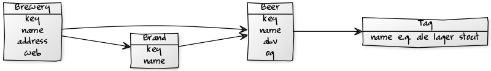

# beerdb-models - beer.db schema 'n' models for easy (re)use


* home  :: [github.com/beerkit/beer.db.models](https://github.com/beerkit/beer.db.models)
* bugs  :: [github.com/beerkit/beer.db.models/issues](https://github.com/beerkit/beer.db.models/issues)
* gem   :: [rubygems.org/gems/beerdb-models](https://rubygems.org/gems/beerdb-models)
* rdoc  :: [rubydoc.info/gems/beerdb-models](http://rubydoc.info/gems/beerdb-models)
* forum :: [groups.google.com/group/beerdb](https://groups.google.com/group/beerdb)


## Usage Models

Class Model Diagram



Brewery Model

```
by = Brewery.find_by_key( 'guinness' )

by.title
=> 'St. James's Gate Brewery / Guinness Brewery'

by.country.key
=> 'ie'

by.country.title
=> 'Ireland'

by.city.title
=> 'Dublin'

by.beers.first
=> 'Guinness', 4.2

...
```


Beer Model

```
b = Beer.find_by_key( 'guinness' )

b.title
=> 'Guinness'

b.abv
=> 4.2

b.tags
=> 'irish_dry_stout', 'dry_stout', 'stout'

b.brewery.title
=> 'St. James's Gate Brewery / Guinness Brewery'

...
```


Country Model

```
at = Country.find_by_key( 'at' )

at.beers
=> 'Weitra Helles', 'Hadmar', 'Zwettler Original', ...

at.breweries
=> 'Weitra Bräu Bierwerkstatt', 'Zwettler Brauerei', ...

...
```


City Model

```
wien = City.find_by_key( 'wien' )

wien.beers
=> 'Ottakringer Helles', 'Ottakringer (Gold Fassl) Zwickl', ...

wien.breweries
=> 'Ottakringer Brauerei'

...
```


## License

The `beerdb-models` scripts are dedicated to the public domain.
Use it as you please with no restrictions whatsoever.

## Questions? Comments?

Send them along to the [Open Beer & Brewery Database Forum/Mailing List](http://groups.google.com/group/beerdb).
Thanks!

